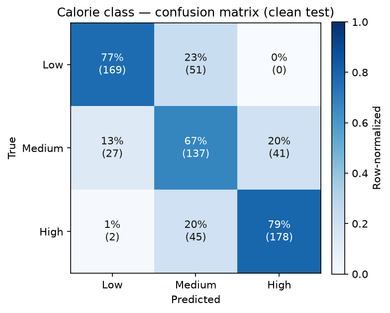
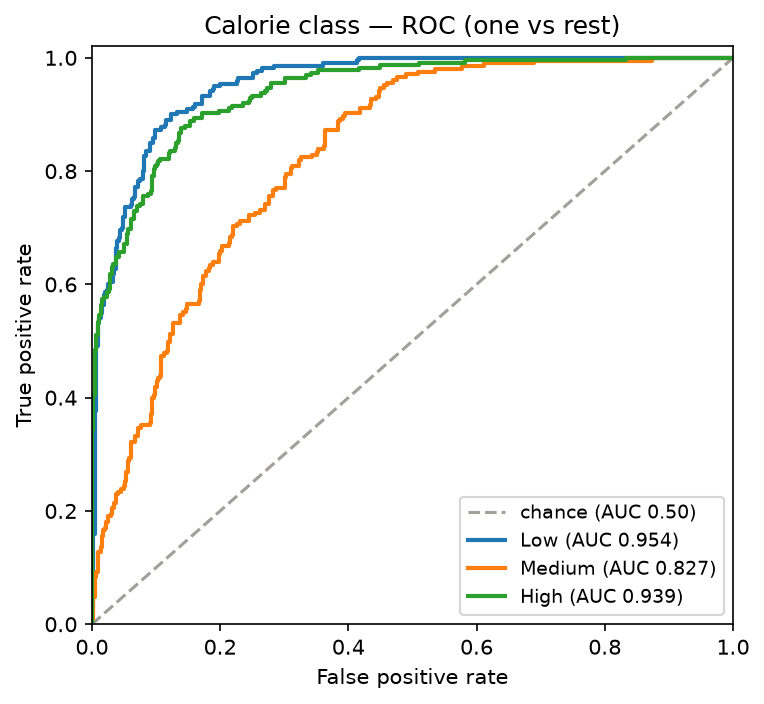

# AI4ALL — Nutrition5k (my independent work)

Calorie classification from food images, built from the raw Nutrition5k dataset — **not** derived
from the group's notebooks. My contribution: a from-scratch model and pipeline, and a
**data-leakage audit** of the split the group used. It found a structural leak the team's own
check missed (94.7% of the test set contaminated), and a controlled 5-seed, 2-architecture
experiment showing that leak inflates the reported accuracy by **~3 points, unanimously** — so the
project's 74.1% is really ~71%. Along the way my first experiment reached the *wrong* conclusion;
the README shows that too, because that's the honest record.

> The team's shared repo is
> [MalikSCole/AI4all-Group-Project](https://github.com/MalikSCole/AI4all-Group-Project). This
> repo is my own work on the same dataset. Everything here — the pipeline, the model, the
> experiment — I wrote from the raw CSVs and images.

## The finding

> **Full write-up:** [docs/session-leakage-nutrition5k.md](docs/session-leakage-nutrition5k.md)
> — the complete methodology, results, limitations, and reproduction commands in one document.

The group verified there is **zero `dish_id` overlap** between train, validation, and test. That
check is correct, and under it the split looks clean.

It answers the wrong question.

Nutrition5k dishes were photographed in rapid **capture sessions**: `dish_id` is literally
`dish_<unix_timestamp>`, and the median gap between consecutive dishes is **41 seconds**. Sorting
by timestamp reveals that **96.9% of dishes were shot in a session with other dishes** — same
table, same lighting, same camera pose, same prep batch. Those dishes are not independent samples.

Under the group's stratified-random split:

- `dish_id` overlap between train and test: **0** ✓ (the check they ran)
- test dishes that share a capture session with a training dish: **94.7%** ✗ (the check they didn't)
- fraction of label variance explained by session identity alone: **25.4%**

The *risk* this creates: a model can score well by learning "this is session 214's lighting, and
session 214 is Medium" without learning anything about food — correlated images, not identical
ones, which is enough to leak. Whether a given model actually does this is an empirical question,
which is why the experiment below tests it rather than asserting it.

**The fix:** split on capture session, so every dish from a session lands entirely in one set.
[`src/data/nutrition5k.py`](src/data/nutrition5k.py) implements both splits; the experiment trains
the same model under each and measures the gap.

## Results

Two experiments. The first (`experiments/leakage.py`) had a confound; the second
(`experiments/leakage_rigorous.py`) fixes it and is the one to trust. I'm keeping both, and
reporting where the first misled me, because that's the honest record.

### Step 1 — the structural leak (proven, deterministic, no model involved)

| | random split | grouped split |
|---|---|---|
| `dish_id` overlap, train↔test | 0 | 0 |
| **test dishes sharing a session with train** | **94.7%** | **0%** |
| label variance explained by session alone | 25.4% | — |

The random split — what the group used, the one that passes a `dish_id` overlap check — leaks
94.7% of its test set through shared capture sessions. This stands regardless of any model.

### Step 2 — does the leak inflate the reported number? (the airtight experiment)

The question that matters, done properly. Every model is scored on **one common held-out test set
of session-disjoint dishes** — the same clean yardstick for all arms, so the comparison isn't
confounded by different test sets (the flaw in my first attempt). Then, holding that yardstick
fixed, I vary only the train/val split: **leaky** (dish-random, val shares sessions with train,
what the group did) vs **clean** (session-grouped). Two architectures — my small GAP model and a
faithful reproduction of the group's big flatten→FC model. 5 seeds. No augmentation, so this
measures the raw leak. `inflation = (the split's own validation accuracy) − (true accuracy on the
common clean test)`:

| arch / split | val acc | true test | **inflation** | positive in |
|---|---|---|---|---|
| small / **leaky** | 0.774 | 0.731 | **+4.3 pt** | **5/5 seeds** |
| small / clean | 0.741 | 0.747 | −0.6 pt | 1/5 |
| big / **leaky** | 0.737 | 0.713 | **+2.4 pt** | **5/5 seeds** |
| big / clean | 0.705 | 0.714 | −1.0 pt | 1/5 |

**Pooled: the leaky split inflates the reported accuracy by +3.3 pt, positive in 10/10 cells. The
clean split's validation tracks truth (−0.8 pt, positive in 2/10).** The result is unanimous, not
within-noise — every leaky cell across both architectures and all five seeds overstates true
generalization.

**So the leak is real *and* it inflates the number — the opposite of what my first experiment
suggested.** That earlier run compared a leaky test set to a *different* clean test set, so
test-set difficulty swamped the signal and the clean set happened to score higher. Scoring
everything on one common clean test removes that confound and the inflation appears cleanly. I'm
leaving the first experiment in the repo, wrong conclusion and all, because pretending I got it
right the first time would be its own dishonesty.

### What I got wrong, explicitly

I hypothesized the **big** flatten→FC model would inflate **more** — that leakage is about
high-capacity memorization. **The data refutes it.** The small model inflated slightly *more*
(+4.3 vs +2.4), and both were unanimous. The inflation doesn't come from a model memorizing
sessions; it comes from the **validation set itself being contaminated** — it contains
session-mates of training dishes, so any model that learns session-correlated features (even
legitimately) scores higher on it. That makes the finding *stronger*, not weaker: it's
architecture-independent, so it applies to the group's model regardless of its design.

### What this establishes about the group's 74.1%

Their reported number is measured on a session-contaminated test set (94.7% contaminated — the
same condition as my "leaky" arm). This experiment says that inflates the number by ~2–3 points,
unanimously and independent of architecture. **So true generalization is ~71%, not 74%.** One
caveat, stated because it cuts against my own point: this measured the *no-augmentation* effect,
and the group uses some augmentation, which suppresses the leak (it destroys session-specific pose
and lighting — see below). Their real inflation is therefore somewhere in (0, 3] points, not
necessarily the full 3.

### Augmentation is a genuine mitigation (reconciling the two experiments)

My first experiment used my model **with** aggressive augmentation and found ~0 net effect; this
one, **without** augmentation, finds +3.3. Both are right: augmentation (flips, 90° rotations,
brightness jitter) destroys exactly the session-specific cues the leak relies on. That's a real,
useful result — augment hard and you partially inoculate against session leakage — but it is a
mitigation, not a fix. The fix is the grouped split, because you should not have to hope your
augmentation happened to cover the leak.

### Bottom line

- **My model, clean session-grouped evaluation: ~73–75%** — 2.2× the 33% baseline, honestly measured.
- A session-contaminated evaluation inflates the reported number by **~3 points, unanimously across
  5 seeds and 2 architectures.** The group's 74.1% is such a number; true is ~71%.
- The effect is architecture-independent — my capacity hypothesis was wrong, and I said so.

Raw numbers: `reports/leakage_rigorous_20cell_2seed-arch.json` (the 20-cell run tabled above) and
`reports/leakage_seed*.json` (the first, confounded experiment, kept for the record). Note:
`reports/leakage_rigorous.json` now holds a later 30-cell three-arm rerun (adds an official-split
arm, run on different hardware — leaky +2.2 pt, positive in 9/10; same conclusion, magnitudes are
hardware-specific — see [the write-up](docs/session-leakage-nutrition5k.md)).

## Evaluation (the Week 12 deliverables)

`python experiments/evaluate.py` trains `CalorieCNN` on the clean session-grouped split and writes
the full evaluation Ru asked for — on my own pipeline, so it does **not** depend on the group's
Kaggle weights. Latest run, on the held-out clean test (650 dishes, session-disjoint):

| Class | Precision | Recall | Specificity | F1 | AUC | Support |
|---|---|---|---|---|---|---|
| Low | 0.854 | 0.768 | 0.933 | 0.809 | 0.954 | 220 |
| Medium | 0.588 | 0.668 | 0.784 | 0.626 | 0.827 | 205 |
| High | 0.813 | 0.791 | 0.904 | 0.802 | 0.939 | 225 |

**Accuracy 74.5%** (2.2× the 33.8% majority baseline) · **Macro-F1 0.745**.

Two things worth a slide each:

**Medium is the hard class, and that's expected.** Low (F1 0.81, AUC 0.95) and High (F1 0.80, AUC
0.94) are cleanly separable; Medium (F1 0.63, AUC 0.83) is not — it's bounded on both sides and
leaks to both neighbours. This is the honest reason a single accuracy number is misleading here,
and exactly why the checklist asks for per-class metrics.

**The ordinal head works — the maximal error almost never happens.** Low↔High confusion is 0% and
1% in the matrix; the off-by-two rate is **0.3%**. Nearly every mistake is between adjacent
classes. That is the payoff of the ordinal design over a plain 3-way softmax, and it's a claim you
can point at rather than assert.




Full numbers in `reports/evaluation.json` / `reports/evaluation.md`.

## The model

`CalorieCNN` ([src/models/cnn.py](src/models/cnn.py)) — built for this dataset, with three
deliberate departures from the group's architecture:

| | Group's | Mine | Why |
|---|---|---|---|
| Spatial collapse | `flatten -> Linear(25088, 128)` | global average pool | Their FC is **3.2M params** trained on ~2,300 images. GAP does it with zero. |
| Normalization | none | BatchNorm every conv | Faster, more stable training. |
| Total params | ~3.3M | **~990K** | On data this small, size *is* overfitting. |
| Ordinal decode | `sum(passed thresholds)` | walk to first failure + flag incoherence | `[0,1]` is incoherent for ordered classes; summing hides it as "Medium". |

It keeps the group's good idea — an **ordinal** head (Low < Medium < High are ordered, so a 3-way
softmax is the wrong loss) — and adds an auxiliary calorie-regression head on `log1p(calories)`,
because the target spans 1–3,900 kcal with a long tail.

It also uses **depth**. Nutrition5k ships an overhead depth map per dish, and calories track mass,
mass tracks volume, and volume is exactly what depth sees and a photograph cannot. RGB+depth is a
4-channel input; the depth channel is scaled on a fixed physical range so absolute height survives.

## Reproduce

```bash
python -m venv .venv && source .venv/bin/activate
pip install -r requirements.txt

# Point at the extracted Nutrition5k archive (the dir with dish_nutrition_values.csv + imagery/)

# The evaluation deliverables — confusion matrix, ROC, per-class metrics on the clean split:
python experiments/evaluate.py --data-root ~/Downloads/archive

# The airtight experiment — 5 seeds x 2 architectures x 2 splits, common clean test:
python experiments/leakage_rigorous.py --data-root ~/Downloads/archive

# The first, confounded experiment (kept for the record; see Results for why it misled):
python experiments/leakage.py --data-root ~/Downloads/archive --epochs 15
```

First run builds a preprocessed image cache (uint8, ~45s). `experiments/leakage_rigorous.py`
writes its results to `reports/leakage_rigorous.json`; each run prints its comparison table.

The test set is **locked**: `src/training/train.py` selects on validation only, and the experiment
touches test exactly once, at the end. This is a guard against the pattern visible in the group's
notebooks, where test accuracy appears six times climbing monotonically (66.9 → 74.1) — the
signature of selecting on the test set until it improves.

## Layout

```
src/data/nutrition5k.py    # manifest, session derivation, both split strategies, leakage report
src/data/cache.py          # one-time uint8 image cache (RGB + depth)
src/models/cnn.py          # CalorieCNN, ordinal decode, majority baseline
src/training/              # dataset (augmentation, normalization) + training loop
experiments/leakage.py     # the headline experiment
tests/                     # split correctness, model shapes, ordinal decode
```

## Ethics

Nutrition5k was captured with a fixed overhead camera in controlled lighting over one culinary
range. A model trained on it is least accurate on food least like that — phone photos at an angle,
cuisines the dataset under-represents. Food datasets skew Western by default, so the people this
would serve worst are those whose food it never saw. And the leakage point generalizes into an
ethics point: a model that looks accurate in-distribution because of leakage will fail quietly on
real users, which is worse than a model that is honestly, visibly mediocre.

## License

MIT — see [LICENSE](LICENSE).
